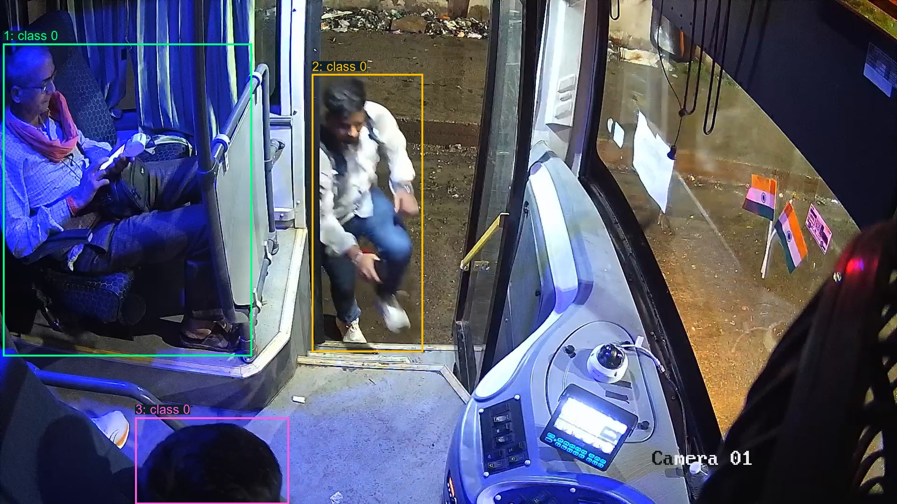
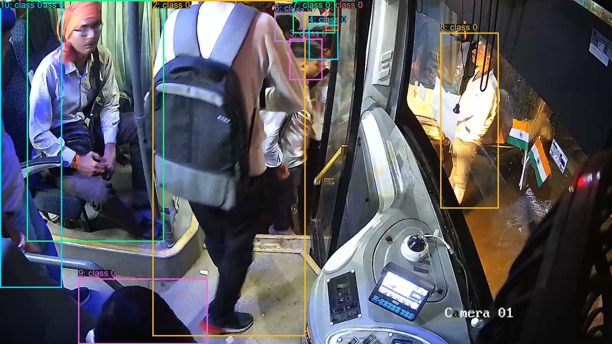

# Проверка YOLO-разметки

Python-утилита для проверки **исходной разметки**, а не предсказаний модели. Работает на Windows, показывает оригиналы и bounding boxes в VS Code, создаёт HTML-галерею и отчёт. Не требует GPU и весов YOLO.

## Возможности

- Сопоставляет изображение и `.txt` по одинаковому имени без расширения.
- Читает формат детекции: `class x_center y_center width height`.
- Спрашивает число кадров, если не задан `--samples`.
- Выбирает кадры равномерно от первого до последнего. Для 425 файлов и 10 образцов: **1, 48, 95, 142, 189, 237, 284, 331, 378, 425**.
- Проверяет размеры, ориентацию EXIF, наличие разметки и координаты.
- Сохраняет наложения, оригиналы, `preview.ipynb` со встроенными картинками, `gallery.html`, `contact_sheet.jpg`, `boxes_pixels.csv` и `audit.json`.
- Сравнивает разметку и изображения с другими ZIP-выгрузками (`--compare-zip`).

## Установка на Windows

Требуется **Python 3.10+**. Откройте папку репозитория в VS Code. В PowerShell:

```powershell
py -m venv .venv
.\.venv\Scripts\python.exe -m pip install -r .\requirements.txt
```

Если `py` недоступен, используйте `python -m venv .venv`. Активация окружения не обязательна. Ошибка `No module named 'PIL'` означает, что Pillow не установлен именно в запускаемом Python; устанавливайте зависимости и запускайте скрипт через один и тот же интерпретатор.

## Быстрая проверка двух примеров

```powershell
.\.venv\Scripts\python.exe .\check_yolo_labels.py --dataset .\examples\dataset --out .\manual_preview
```

Введите `2`. Затем откройте `manual_preview/preview.ipynb` в VS Code: изображения уже встроены, запускать блокнот для их просмотра не нужно.

## Свой датасет

```powershell
.\.venv\Scripts\python.exe .\check_yolo_labels.py --dataset "D:\datasets\my_dataset" --out .\my_preview
```

Для десяти кадров без вопроса добавьте `--samples 10`. Для фильтра по имени: `--name frame_008070`.

Структура: `train/images/*.jpg` и `train/labels/*.txt`; также поддерживаются разделы `valid`, `val`, `test`. Разделы обходятся в порядке `train`, `valid`, `val`, `test`, внутри каждого файлы сортируются по имени. При фильтрации выборка охватывает отфильтрованный список. При выборе одного файла показывается первый. Если `--samples` больше доступного числа, показываются все.

## Картинки прямо в VS Code

Установите расширения Microsoft **Python** и **Jupyter**.

- Откройте `inspect_yolo_labels.ipynb`, выберите ядро `.venv`, задайте `DATASET` и нажмите ▶. По умолчанию в блокноте выбран небольшой датасет из `examples/dataset`. После вопроса изображения появятся под ячейкой.
- Либо откройте `check_yolo_labels.py`, задайте `DEFAULT_DATASET` и выполните **Jupyter: Run Current File in Python Interactive Window** или **Run Cell** над `# %%`.

Обычный терминал изображения не отображает: после запуска в нём смотрите созданный `preview.ipynb` или HTML-галерею. Подробности: [WINDOWS_VSCODE.md](WINDOWS_VSCODE.md). Личный путь к полному датасету, указанный в исходной версии Python-файла, можно заменить или переопределить через `--dataset`.

## Примеры наложения

### frame_008070 — три бокса



### frame_030610 — десять боксов



Оригиналы находятся в `examples/dataset/train/images`, разметка — в `examples/dataset/train/labels`. Номера рамок — номера боксов, `class 0` — `human`; цвета не означают разные классы. [Источник и атрибуция примеров](examples/README.md).

## Координаты и ограничения

Для ширины изображения W и высоты H:

```python
x1 = (x_center - width / 2) * W
y1 = (y_center - height / 2) * H
x2 = (x_center + width / 2) * W
y2 = (y_center + height / 2) * H
```

Первые две координаты — **центр**, не левый верхний угол. Формат обычных боксов общий для YOLOv5, YOLOv8 и YOLO26. Сегментация, позы и повёрнутые боксы не поддерживаются.

Наложение производится на исходные пиксели без letterbox и автоматического поворота EXIF. При ориентации EXIF, отличной от 1, сначала проверьте систему координат разметки. Скрипт не гарантирует правильность каждой аннотации или её совпадение с актуальным состоянием разметчика.

## Проверки

```powershell
.\.venv\Scripts\python.exe -m unittest discover -s tests -v
```

Выборка проверена на 10 200 сочетаниях количества файлов и образцов. Первоначально обработаны 425 изображений и 1444 бокса; локальные выгрузки YOLOv5, YOLOv8 и YOLO26 согласованы между собой. Это не проверка качества обученной модели.

## Безопасность

Исходный датасет не изменяется. Результаты должны сохраняться вне него. Повторный запуск обновляет свои файлы, но не удаляет старые картинки прежней выборки; для независимого запуска используйте новый `--out`. Окружения, полный датасет, секреты и генерируемые отчёты не входят в репозиторий.

В этом репозитории уже указан файл [LICENSE](LICENSE) с Apache License 2.0; он сохранён без изменений. Для фотографий и разметки действуют условия источника, описанные в [examples/README.md](examples/README.md); лицензию программного кода не следует автоматически распространять на эти примеры.
